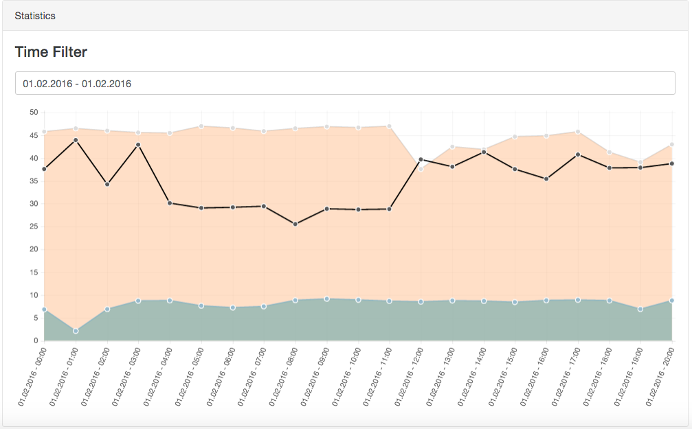

# Docker Speedtest Analyser

Automated docker speedtest analyzer tool with included web interface to monitor your internet speed connection over time. Setup at home on your NAS (Synology, QNAP tested) and the container runs hourly speedtests. The speedtest results are displayed in an web interface as line graph(s) over the day.

This repository is based on the excellent [roest01/docker-speedtest-analyser](https://github.com/roest01/docker-speedtest-analyser). This version, however, has diverged significantly and is now maintained separately by [@joelvaneenwyk](https://github.com/joelvaneenwyk).

## Overview

1. Docker image is built off [fabiocicerchia/nginx-lua](https://github.com/fabiocicerchia/nginx-lua) to get latest NGINX and Lua modules by default.
2. Repository is automatically deployed to [Docker Hub](https://hub.docker.com/repository/docker/joelvaneenwyk/speedtest-analyzer)
3. Data is saved to  `/usr/share/nginx/html/data/results.csv` on Docker instance. Mount this data folder.
4. ⚠ NGINX is prepared but not configured for SSL

## History

This tool was created in reference to [this reddit post](https://www.reddit.com/r/technology/comments/43fi39/i_set_up_my_raspberry_pi_to_automatically_tweet/).
It used [speedtest-cli](https://github.com/sivel/speedtest-cli) to make speedtests and log them into a CSV file. After that you can visit the web interface to view hourly, time-filterable reports about your internet connectivity speed.

## Installation

The SpeedTest analyzer is expected to run out-of-the-box with [Docker](https://www.docker.com/).

**Important:** To keep the history of speedtest within a rebuild of the container please mount a volume in `/usr/share/nginx/html/data/`.

### Setup

1. Mount host volume onto `/usr/share/nginx/html/data/`
2. Map preferred host port on port `80`
3. Build container from image
4. Enjoy continuous speed statistics

## Environment Variables

| Variable  | Type | Usage |  Example Value | Default |
| ------------- | ------------- | ------------- | ------------- | ------------- |
| CRONJOB_ITERATION  | INT  | Time between speedtests in minutes. Value 15 means the cronjob runs every 15 minutes. Keep undefined to run hourly. | 15 | 60 |
| SPEEDTEST_PARAMS  | STRING  | Append extra parameter for cli command (i.e., `speedtest-cli --simple $SPEEDTEST_PARAMS`). See [parameter documentation](https://github.com/sivel/speedtest-cli#usage) for available options.  | `--mini https://speedtest.test.fr` | none |

## Configuration

You can configure the visualization frontend using JavaScript.

1. Copy `/js/config.template.js` into `/data/config.js` where your volume should be mounted. Note that this is done automatically if you run the Docker first.
2. Update the values in `/data/config.js` and restart your Docker instance.

## Dependencies

* [Introduction · Bootstrap v5.0](https://getbootstrap.com/docs/5.0/getting-started/introduction/)
* [Chart.js | Open source HTML5 Charts for your website](https://www.chartjs.org/)
* [Date Range Picker — JavaScript Date & Time Picker Library](https://www.daterangepicker.com/)
* [Moment.js | Home](https://momentjs.com/)
* [Papa Parse - Powerful CSV Parser for JavaScript](https://www.papaparse.com/)
* [speedtest-cli: Command line interface for testing internet bandwidth using speedtest.net](https://github.com/sivel/speedtest-cli)
